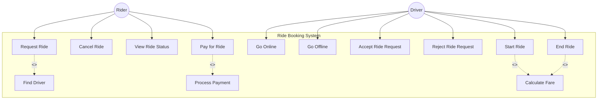

# Use Case Diagram - BuildingRiderSystem

## Overview

A **Use Case Diagram** shows the system's functionality from a user's perspective. It identifies actors (who uses the system) and use cases (what they can do), establishing the system boundary.

## UML Concepts Explained

### Actors

- **Actor**: External entities that interact with the system (users, other systems)
- Represented as stick figures or rectangles with `<<actor>>` stereotype
- In our system: **Rider**, **Driver**

### Use Cases

- **Use Case**: Specific functionality or goal an actor can achieve
- Represented as ovals or rectangles with rounded corners
- Each use case should represent a complete, meaningful action

### Relationships

- **Association**: Line connecting actor to use case (who does what)
- **Include**: One use case always includes another (`<<include>>`)
- **Extend**: Optional use case that extends another (`<<extend>>`)

### System Boundary

- Rectangle that contains all use cases
- Everything inside is the system, actors are outside

## Use Case Diagram for BuildingRiderSystem

## Mapping to Project Context

Based on [ProjectContext.md](../ProjectContext.md), here's how each use case maps:

### Rider Use Cases

| Use Case             | Description                                          | Source                         |
| -------------------- | ---------------------------------------------------- | ------------------------------ |
| **Request Ride**     | Rider requests a ride with pickup and drop locations | Step 1: "Can request a ride"   |
| **Cancel Ride**      | Rider cancels a ride request                         | Step 1: "Can cancel a ride"    |
| **View Ride Status** | Rider checks current ride status                     | Step 1: "Can view ride status" |
| **Pay for Ride**     | Rider pays for completed ride                        | Step 1: "Can pay for a ride"   |

### Driver Use Cases

| Use Case                | Description                        | Source                                   |
| ----------------------- | ---------------------------------- | ---------------------------------------- |
| **Go Online**           | Driver becomes available for rides | Step 1: "Can go online/offline"          |
| **Go Offline**          | Driver becomes unavailable         | Step 1: "Can go online/offline"          |
| **Accept Ride Request** | Driver accepts a ride request      | Step 1: "Can accept/reject ride request" |
| **Reject Ride Request** | Driver rejects a ride request      | Step 1: "Can accept/reject ride request" |
| **Start Ride**          | Driver starts the ride             | Step 1: "Can start ride"                 |
| **End Ride**            | Driver ends the ride               | Step 1: "Can end ride"                   |

### System Use Cases (Internal)

| Use Case            | Description                             | Source                      |
| ------------------- | --------------------------------------- | --------------------------- |
| **Find Driver**     | System matches nearest available driver | Step 1: "Finds a driver"    |
| **Calculate Fare**  | System calculates ride fare             | Step 1: "Calculates fare"   |
| **Process Payment** | System processes payment                | Step 1: "Processes payment" |

### Relationships Explained

- **Include**: `Request Ride` always includes `Find Driver` (system must find a driver)
- **Include**: `Start Ride` and `End Ride` include `Calculate Fare` (fare calculated at these points)
- **Include**: `Pay for Ride` includes `Process Payment` (payment processing is part of paying)

## Key Takeaways

1. **Start Simple**: Use cases should be high-level, user-focused actions
2. **Actor Perspective**: Think from the actor's viewpoint - what do they want to achieve?
3. **Complete Actions**: Each use case should represent a complete, meaningful goal
4. **System Boundary**: Clearly separates what the system does vs. what actors do
5. **Relationships**: Use `<<include>>` for mandatory steps, `<<extend>>` for optional enhancements

## When to Use Use Case Diagrams

- **Requirements Gathering**: Understand what the system should do
- **Communication**: Discuss functionality with stakeholders
- **System Scope**: Define what's in scope vs. out of scope
- **Design Phase**: Before diving into classes and interactions

## Next Steps

After understanding the system's functionality (Use Cases), we'll dive into the **Class Diagram** to see how these use cases are implemented through classes and their relationships.
