# Class Diagram - BuildingRiderSystem

## Overview

A **Class Diagram** is the most fundamental UML diagram. It shows the system's static structure: classes, their attributes, methods, and relationships. This diagram is essential for understanding OOP relationships.

## UML Concepts Explained

### Class Notation
A class is represented as a rectangle with three compartments:
1. **Name** (top): Class name in PascalCase
2. **Attributes** (middle): Properties/fields with visibility and type
3. **Methods** (bottom): Operations with visibility, parameters, and return type

### Visibility Symbols
- **`+`** Public: Accessible from anywhere
- **`-`** Private: Only accessible within the class
- **`#`** Protected: Accessible within class and subclasses
- **`~`** Package: Accessible within the same package

### Multiplicity Indicators
- **`1`**: Exactly one
- **`0..1`**: Zero or one (optional)
- **`*`**: Zero or more
- **`1..*`**: One or more
- **`n..m`**: Range from n to m

## Class Diagram for BuildingRiderSystem

```mermaid
classDiagram
    %% Enums
    class RideStatus {
        <<enumeration>>
        REQUESTED
        ACCEPTED
        IN_PROGRESS
        COMPLETED
        CANCELLED
    }
    
    class DriverStatus {
        <<enumeration>>
        OFFLINE
        ONLINE
        BUSY
    }
    
    %% Value Objects
    class Location {
        -double latitude
        -double longitude
        +getLatitude() double
        +getLongitude() double
        +distanceTo(Location) double
    }
    
    class Money {
        -double amount
        -string currency
        +getAmount() double
        +getCurrency() string
    }
    
    %% Core Entities
    class Rider {
        -string id
        -string name
        -string phone
        +getId() string
        +getName() string
        +requestRide(pickup Location, drop Location) Ride
    }
    
    class Driver {
        -string id
        -string name
        -string vehicleNumber
        -DriverStatus status
        -Location currentLocation
        +getId() string
        +goOnline() void
        +goOffline() void
        +acceptRide(ride Ride) void
        +rejectRide(ride Ride) void
        +startRide(ride Ride) void
        +endRide(ride Ride) void
    }
    
    %% Composition - Child objects
    class RideEvent {
        -DateTime timestamp
        -string eventType
        -string description
        +getTimestamp() DateTime
        +getEventType() string
    }
    
    class RoutePoint {
        -Location location
        -DateTime timestamp
        -string pointType
        +getLocation() Location
    }
    
    %% Core Entity - Ride
    class Ride {
        -string id
        -RideStatus status
        -Location pickupLocation
        -Location dropLocation
        -Money fare
        -List~RideEvent~ events
        -List~RoutePoint~ route
        +getId() string
        +getStatus() RideStatus
        +accept() void
        +start() void
        +complete() void
        +cancel() void
        +addEvent(event RideEvent) void
    }
    
    %% Payment Interface and Implementations
    class PaymentMethod {
        <<interface>>
        +processPayment(amount Money) boolean
        +refund(amount Money) boolean
    }
    
    class CashPayment {
        +processPayment(amount Money) boolean
        +refund(amount Money) boolean
    }
    
    class UPIPayment {
        -string upiId
        +processPayment(amount Money) boolean
        +refund(amount Money) boolean
    }
    
    class CardPayment {
        -string cardNumber
        -string expiryDate
        +processPayment(amount Money) boolean
        +refund(amount Money) boolean
    }
    
    class Payment {
        -string id
        -Money amount
        -DateTime timestamp
        -boolean isSuccess
        +getId() string
        +process(paymentMethod PaymentMethod) boolean
    }
    
    %% Services
    class RideService {
        -RideRepository rideRepository
        -MatchingService matchingService
        -PricingService pricingService
        +requestRide(rider Rider, pickup Location, drop Location) Ride
        +cancelRide(rideId string) void
    }
    
    class MatchingService {
        -DriverRepository driverRepository
        +findNearestDriver(pickupLocation Location) Driver
        +isDriverAvailable(driver Driver) boolean
    }
    
    class PricingService {
        -double baseFare
        -double perKmRate
        -double perMinRate
        +calculateFare(pickup Location, drop Location) Money
    }
    
    class PaymentService {
        +processPayment(payment Payment, method PaymentMethod) boolean
    }
    
    %% Repositories
    class RideRepository {
        +save(ride Ride) void
        +findById(id string) Ride
        +findByRiderId(riderId string) List~Ride~
    }
    
    class DriverRepository {
        +save(driver Driver) void
        +findById(id string) Driver
        +findAvailableDrivers(location Location) List~Driver~
    }
    
    class RiderRepository {
        +save(rider Rider) void
        +findById(id string) Rider
    }
    
    %% === RELATIONSHIPS ===
    
    %% 1. ASSOCIATION (bidirectional, independent existence)
    Rider "1" --> "*" Ride : requests
    Driver "1" --> "*" Ride : drives
    Ride "1" --> "1" Rider : belongs to
    Ride "1" --> "1" Driver : assigned to
    
    %% 2. COMPOSITION (strong ownership, child dies with parent)
    Ride "1" --> "*" RideEvent : contains
    Ride "1" --> "*" RoutePoint : contains
    
    %% 3. AGGREGATION (weak ownership, child exists independently)
    MatchingService "1" --> "*" Driver : uses (pool)
    DriverRepository "1" --> "*" Driver : manages
    
    %% 4. DEPENDENCY (uses temporarily, no permanent reference)
    RideService ..> MatchingService : uses (method param)
    RideService ..> PricingService : uses (method param)
    PricingService ..> Location : uses (calculation)
    PaymentService ..> PaymentMethod : uses (polymorphism)
    
    %% 5. REALIZATION (interface implementation)
    PaymentMethod <|.. CashPayment : implements
    PaymentMethod <|.. UPIPayment : implements
    PaymentMethod <|.. CardPayment : implements
    
    %% Other relationships
    Ride --> RideStatus : uses
    Driver --> DriverStatus : uses
    Ride --> Location : uses
    Ride --> Money : uses
    Payment --> Money : uses
    Payment --> PaymentMethod : uses
    RideService --> RideRepository : uses
    MatchingService --> DriverRepository : uses
```

## Mapping to Project Context

Based on [ProjectContext.md](../ProjectContext.md), here's how each OOP relationship maps:

### 1. ✅ Association (Rider ↔ Ride, Driver ↔ Ride)

**Definition**: A relationship where two classes are related but can exist independently.

**In our system**:
- `Ride` ↔ `Rider`: A ride belongs to a rider, but rider exists without rides
- `Ride` ↔ `Driver`: A ride is assigned to a driver, but driver exists without rides

**UML Notation**: Solid line with arrow (bidirectional) or unidirectional arrow
- Multiplicity: `1..*` Ride per Rider/Driver (one can have many rides)
- Multiplicity: `1` Rider/Driver per Ride (each ride has exactly one rider and one driver)

**Source**: Step 4 - "They are related, but rider/driver exist without ride."

---

### 2. ✅ Aggregation (MatchingService → Driver pool)

**Definition**: "Has-a" relationship where the child can exist independently of the parent (weak ownership).

**In our system**:
- `MatchingService` operates on a pool/list of `Driver` objects
- Drivers exist independently; they can switch services/cities
- The service uses drivers but doesn't own them

**UML Notation**: Hollow diamond on the parent side → child
- Parent (MatchingService) has hollow diamond
- Child (Driver) is at arrow end
- Multiplicity: `1` MatchingService to `*` Drivers

**Source**: Step 4 - "MatchingService operates on a pool/list of drivers" and "Example: drivers can switch cities/systems."

---

### 3. ✅ Composition (Ride → RideEvent[], Ride → RoutePoint[])

**Definition**: "Part-of" relationship where the child cannot exist without the parent (strong ownership).

**In our system**:
- `Ride` contains `RideEvent[]` (timeline events)
- `Ride` contains `RoutePoint[]` (pickup/drop locations)
- These child objects have no meaning without the ride
- When ride is deleted, events and route points are deleted too

**UML Notation**: Filled diamond on the parent side → child
- Parent (Ride) has filled diamond
- Child (RideEvent, RoutePoint) is at arrow end
- Multiplicity: `1` Ride to `*` Events/RoutePoints

**Source**: Step 4 - "These child objects have no meaning without the ride."

---

### 4. ✅ Dependency (RideService → MatchingService, PricingService)

**Definition**: A temporary relationship where one class uses another but doesn't permanently store a reference.

**In our system**:
- `RideService.requestRide()` uses `MatchingService` (passed as parameter or called temporarily)
- `PricingService` uses `Location` for calculations
- `PaymentService` uses `PaymentMethod` interface (polymorphism)

**UML Notation**: Dashed arrow (→)
- Shows that one class depends on another
- Usually represents method parameter usage, local variable usage, or method calls

**Source**: Step 4 - "No permanent reference required in some cases (method param usage)."

---

### 5. ✅ Realization (PaymentMethod interface ← CashPayment, UPIPayment, CardPayment)

**Definition**: A class implements an interface, agreeing to provide specific behavior.

**In our system**:
- `PaymentMethod` interface defines the contract
- `CashPayment`, `UPIPayment`, `CardPayment` implement the interface
- Same contract (`processPayment()`, `refund()`), different behavior

**UML Notation**: Dashed arrow with closed arrowhead (→) or triangle (interface → implementer)
- Interface shown with `<<interface>>` stereotype or as a circle
- Implementation classes point to interface

**Source**: Step 4 - "Same contract, different behavior."

---

## Key Takeaways

### Relationship Strength (weakest to strongest)
1. **Dependency** (→→→): Temporary usage, no stored reference
2. **Association** (→): Related but independent
3. **Aggregation** (◊→): Has-a, child can exist alone
4. **Composition** (◆→): Part-of, child dies with parent
5. **Realization** (⟹): Contract implementation (interface)

### Decision Guide
- **Use Association** when: Classes are related but independent (Rider ↔ Ride)
- **Use Aggregation** when: Parent contains child, but child can exist alone (MatchingService → Driver pool)
- **Use Composition** when: Child is part of parent, cannot exist alone (Ride → RideEvent)
- **Use Dependency** when: Temporary usage, method parameters (RideService uses MatchingService)
- **Use Realization** when: Class implements interface/contract (PaymentMethod implementations)

### Common Mistakes to Avoid
1. ❌ Using composition when aggregation is appropriate (ask: can child exist without parent?)
2. ❌ Using association when dependency is sufficient (ask: is there a permanent reference?)
3. ❌ Confusing aggregation with composition (remember: hollow vs. filled diamond)
4. ❌ Missing multiplicity indicators (they're essential for clarity)

## When to Use Class Diagrams

- **System Design**: Before coding, design your class structure
- **Documentation**: Explain system architecture to team members
- **Refactoring**: Understand relationships before changing code
- **Code Reviews**: Visualize dependencies and relationships

## Next Steps

After understanding the static structure (Classes), we'll explore the **State Diagram** to see how a Ride object transitions through different states during its lifecycle.
