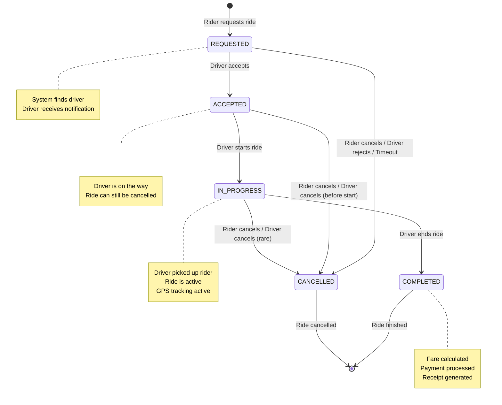
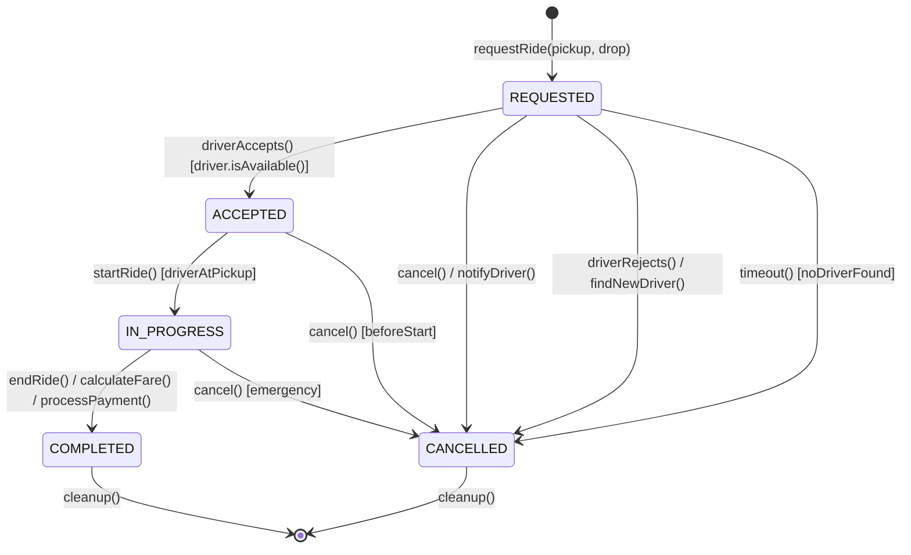

# State Diagram - BuildingRiderSystem

## Overview

A **State Diagram** (also called State Machine Diagram) shows how an object transitions between different states during its lifetime. It's perfect for modeling objects with clear state-dependent behavior.

## UML Concepts Explained

### States

- **State**: A condition or situation during an object's lifecycle
- Represented as rounded rectangles
- A state represents a stable condition where the object waits for an event

### Initial State

- **Initial State**: The starting point (filled circle)
- Only one initial state per state diagram

### Final State

- **Final State**: The end point (filled circle inside a larger circle)
- Can have multiple final states

### Transitions

- **Transition**: An arrow showing movement from one state to another
- Labeled with: `event [guard] / action`
  - **Event**: What triggers the transition
  - **Guard**: Condition that must be true (optional)
  - **Action**: What happens during transition (optional)

### State Types

- **Simple State**: Basic state without substates
- **Composite State**: State containing substates
- **History State**: Remember the last substate (H\*)

## State Diagram for Ride Lifecycle



## Detailed State Transitions

### State: REQUESTED

**Description**: Rider has requested a ride, system is finding a driver.

**Entry Actions**:

- Create Ride object
- Find nearest available driver (MatchingService)
- Send notification to driver

**Exit Conditions**:

- Driver accepts → ACCEPTED
- Rider cancels → CANCELLED
- Driver rejects → CANCELLED
- Timeout (no driver available) → CANCELLED

**Can transition to**: ACCEPTED, CANCELLED

---

### State: ACCEPTED

**Description**: Driver has accepted the ride request, heading to pickup location.

**Entry Actions**:

- Assign driver to ride
- Update driver status to BUSY
- Notify rider that driver accepted

**Exit Conditions**:

- Driver starts ride → IN_PROGRESS
- Rider cancels → CANCELLED
- Driver cancels → CANCELLED

**Business Rule**: "ACCEPTED → CANCELLED (if not started)" (from ProjectContext.md)

**Can transition to**: IN_PROGRESS, CANCELLED

---

### State: IN_PROGRESS

**Description**: Ride has started, driver is transporting the rider.

**Entry Actions**:

- Mark ride as started
- Start GPS tracking
- Begin fare calculation timer

**Exit Conditions**:

- Driver ends ride → COMPLETED
- Rider cancels → CANCELLED (rare, but possible)
- Driver cancels → CANCELLED (rare, emergency)

**Can transition to**: COMPLETED, CANCELLED

---

### State: COMPLETED

**Description**: Ride has ended successfully, payment processed.

**Entry Actions**:

- Calculate final fare
- Process payment
- Generate receipt
- Update driver status to AVAILABLE

**Exit Conditions**:

- None (final state)
- Transitions to [*] (object lifecycle ends)

**Can transition to**: [*] (final state)

---

### State: CANCELLED

**Description**: Ride was cancelled before completion.

**Entry Actions**:

- Mark ride as cancelled
- Release driver (make available)
- Apply cancellation rules (if any)
- Notify relevant parties

**Exit Conditions**:

- None (final state)
- Transitions to [*] (object lifecycle ends)

**Can transition to**: [*] (final state)

---

## Mapping to Project Context

Based on [ProjectContext.md](../ProjectContext.md), here's how the state diagram maps:

### Valid State Transitions (Step 3 - Business Rules)

From the project context:

> **Valid transitions only:**
>
> - REQUESTED → ACCEPTED → IN_PROGRESS → COMPLETED
> - REQUESTED → CANCELLED
> - ACCEPTED → CANCELLED (if not started)

Our state diagram implements exactly these rules:

1. ✅ **Happy Path**: REQUESTED → ACCEPTED → IN_PROGRESS → COMPLETED
2. ✅ **Early Cancellation**: REQUESTED → CANCELLED
3. ✅ **Cancellation After Acceptance**: ACCEPTED → CANCELLED

### Additional Edge Cases Modeled

We also model these realistic scenarios:

- **Driver Rejection**: REQUESTED → CANCELLED (driver rejects, system finds another or cancels)
- **Timeout**: REQUESTED → CANCELLED (no driver available in time)
- **Emergency Cancellation**: IN_PROGRESS → CANCELLED (rare but possible)

---

## State Diagram with Guards and Actions

Here's a more detailed version showing guards and actions:



## Key Takeaways

### When to Use State Diagrams

1. **Objects with Clear States**: Use when an object has distinct states (like RideStatus)
2. **State-Dependent Behavior**: When behavior changes based on state
3. **Complex Lifecycles**: When an object has multiple paths through its lifecycle
4. **Business Rules**: When business rules define valid state transitions

### State Diagram Best Practices

1. ✅ **Clear State Names**: Use descriptive names (COMPLETED not DONE)
2. ✅ **Show All Transitions**: Don't hide edge cases (show CANCELLED paths)
3. ✅ **Include Guards**: Use guards to show when transitions are valid
4. ✅ **Document Actions**: Show what happens during transitions
5. ✅ **Initial/Final States**: Always show start and end points

### Common Mistakes to Avoid

1. ❌ **Missing Final States**: Every state diagram needs [*] final states
2. ❌ **Missing Guards**: If a transition is conditional, show the guard
3. ❌ **Too Many States**: Keep it simple; combine related states if needed
4. ❌ **Undocumented Transitions**: Explain why transitions happen

### State vs. Activity Diagram

- **State Diagram**: Shows object states (WHAT state is the object in?)
- **Activity Diagram**: Shows process flow (WHAT steps happen?)

For Ride lifecycle, **State Diagram** is appropriate because:

- Ride has clear states (REQUESTED, ACCEPTED, etc.)
- Behavior depends on state
- We care about state transitions, not just process steps

## Implementation Considerations

When implementing Ride state transitions in code:

1. **State Enum**: Define `RideStatus` enum with all states
2. **State Machine**: Validate transitions (only allow valid transitions)
3. **Guard Logic**: Check conditions before allowing transitions
4. **Actions**: Execute actions during state transitions
5. **Events**: Trigger transitions based on events (driver accepts, etc.)

Example pattern:

```typescript
class Ride {
  private status: RideStatus;

  accept(): void {
    if (this.status !== RideStatus.REQUESTED) {
      throw new Error("Can only accept REQUESTED rides");
    }
    this.status = RideStatus.ACCEPTED;
    // Actions: notify rider, update driver status
  }
}
```

## Next Steps

After understanding state transitions (State Diagram), we'll explore the **Sequence Diagram** to see how objects interact over time during the ride booking process.
